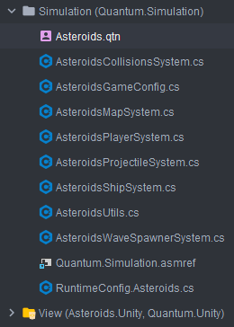
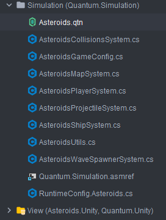

# Quantum QTN File Icon

A minimal JetBrains plugin that adds a custom file icon for [Photon Quantum](https://www.photonengine.com/quantum) `.qtn` files.

## Preview

| Before | After |
|:---:|:---:|
|  |  |

## Features

- 🎨 Custom icon for `*.qtn` files in the Project View, editor tabs, and navigation
- ⚡ Zero performance overhead — no file type registration, no parser, no PSI tree traversal
- 🔧 Fully compatible with the manual "Recognized File Types" setup recommended by Photon Quantum docs
- 🌐 Works in all JetBrains IDEs: Rider, IntelliJ IDEA, WebStorm, CLion, etc.

## Installation

### From Disk

1. Download the latest `.zip` from [Releases](https://github.com/MuhammedResulBilkil/intellij-quantum-qtn-file-icon/releases)
2. In your JetBrains IDE: **Settings** → **Plugins** → ⚙️ → **Install Plugin from Disk…**
3. Select the downloaded `.zip` file
4. Restart the IDE

## Building from Source

### Prerequisites

- Java 17+ (Java 25 also works)
- Gradle 8.13+ (included via wrapper)

### Build

```bash
./gradlew buildPlugin
```

The plugin `.zip` will be generated at `build/distributions/`.

### Run in Sandbox IDE

```bash
./gradlew runIde
```

This launches a sandbox IDE instance with the plugin pre-installed for testing.

## How It Works

The plugin uses a single `IconProvider` extension point (`com.intellij.iconProvider`) to provide a custom icon for files with the `.qtn` extension. It does **not** register a file type, language, or parser — making it fully compatible with any existing manual file type setup.

## Compatibility

| IDE | Supported |
|---|---|
| JetBrains Rider | ✅ |
| IntelliJ IDEA | ✅ |
| WebStorm | ✅ |
| CLion | ✅ |
| All JetBrains IDEs | ✅ |

**Minimum IDE version:** 2024.3+

## Contributing

Contributions are welcome! See [CONTRIBUTING.md](CONTRIBUTING.md) for guidelines.

## License

This project is licensed under the [MIT License](LICENSE).
